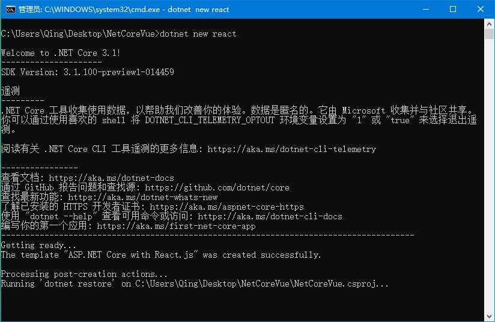

.Net Core Vue Qucik Start
===========================

This is a ASP.NET Core 3.0 project seamlessly integrationed with Vue.js template.
---------------------------

**A complaint from Microsoft officials:**

As far as I'm aware, we don't have plans to introduce Vue-specific features. This isn't because we have anything against Vue, but rather just to limit the growth in the number of frameworks that we're maintaining support for. The dev team only has a finite capacity for handling third-party concepts, and last year we made the strategic choice to focus on only Angular and React.

**Microsoft won't stop our enthusiasm for vuejs**

The Microsoft's dev team only has a finite capacity for handling third-party concepts, but we chinese men don't. Men can never say no.

## Let's Set Sail

### 1. Create a new project with react template

* You can use Visual Studio to create a project with React.js.

* Or execute `dotnet new react` command in Command Line Tools.

