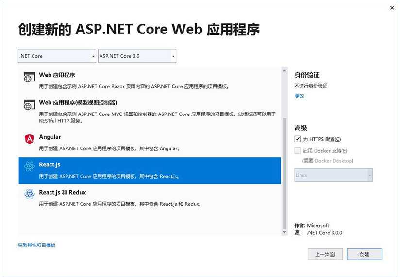
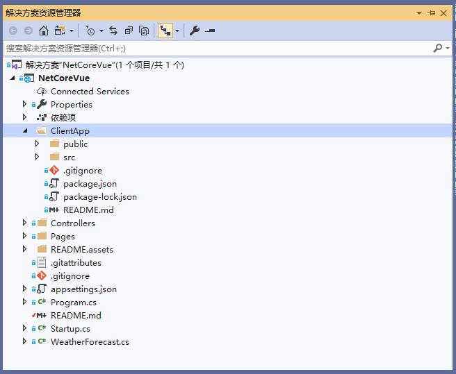
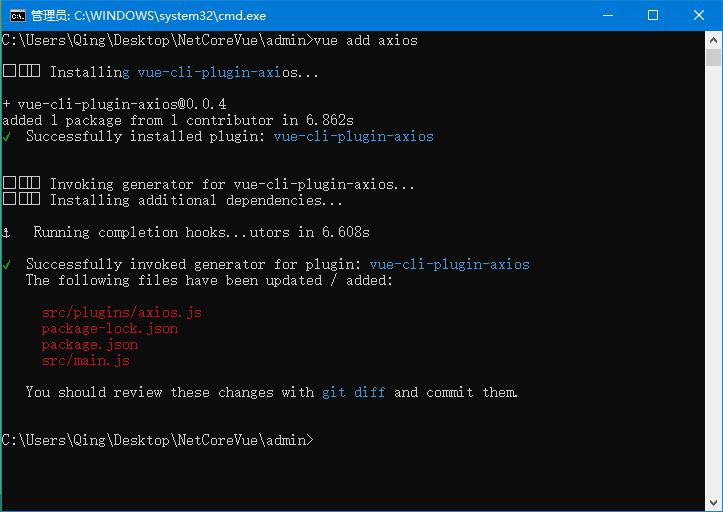
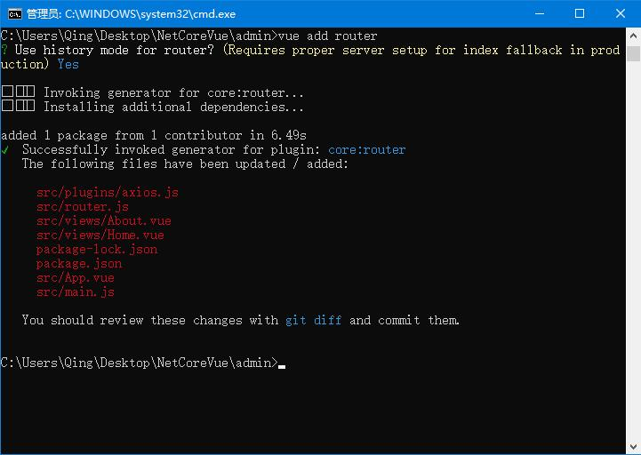
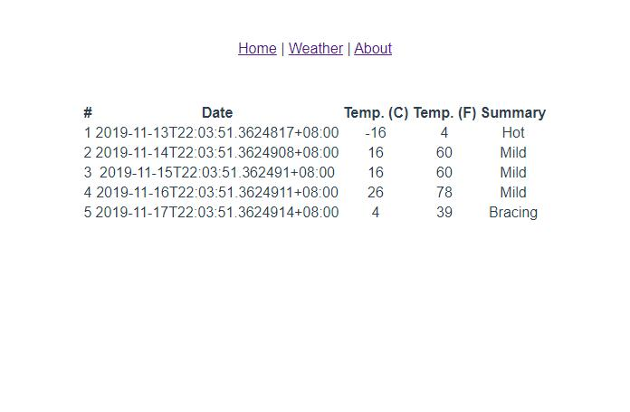

.Net Core Vue Qucik Start
===========================

This is a ASP.NET Core 3.0 project seamlessly integrationed with Vue.js template.
---------------------------

**A complaint from Microsoft officials:**

As far as I'm aware, we don't have plans to introduce Vue-specific features. This isn't because we have anything against Vue, but rather just to limit the growth in the number of frameworks that we're maintaining support for. The dev team only has a finite capacity for handling third-party concepts, and last year we made the strategic choice to focus on only Angular and React.

**Microsoft won't stop our enthusiasm for vuejs**

The Microsoft's dev team only has a finite capacity for handling third-party concepts, but we chinese men don't. Men can never say no.

## Let's Set Sail

### 1. Create a new project with react template

* You can use Visual Studio to create a project with React.js:



* Or execute `dotnet new react` command in Command Line Tools:


### 2. Change Reactjs template to Vuejs template

* Remove `ClientApp` folder:




* Create new vue template project in root folder:


* Rename all `ClientApp` folder to our vue project name:

> Startup.cs

```csharp
    public void ConfigureServices(IServiceCollection services)
    {
        ...

        services.AddSpaStaticFiles(configuration =>
        {
            // configuration.RootPath = "ClientApp/build";
            configuration.RootPath = "admin/build";
        });
    }

    public void Configure(IApplicationBuilder app, IWebHostEnvironment env)
    {
        ...

        app.UseSpa(spa =>
        {
            // spa.Options.SourcePath = "ClientApp";
            spa.Options.SourcePath = "admin";

            ...
        });
    }
```

> NetCoreVue.csproj

```xml
  <PropertyGroup>
    <TargetFramework>netcoreapp3.0</TargetFramework>
    <TypeScriptCompileBlocked>true</TypeScriptCompileBlocked>
    <TypeScriptToolsVersion>Latest</TypeScriptToolsVersion>
    <IsPackable>false</IsPackable>
    <!-- <SpaRoot>ClientApp\</SpaRoot> -->
    <SpaRoot>admin\</SpaRoot>
    <DefaultItemExcludes>$(DefaultItemExcludes);$(SpaRoot)node_modules\**</DefaultItemExcludes>
  </PropertyGroup>
```

* Add `VueCliMiddleware` package from nuget: 

> Run `dotnet add package VueCliMiddleware` command in the Package Manager Console.


* Change `ReactDevelopmentServer` to `VueCli`:

```csharp
    public void Configure(IApplicationBuilder app, IWebHostEnvironment env)
    {
        ...  

        app.UseSpa(spa =>
        {
            spa.Options.SourcePath = "admin";

            if (env.IsDevelopment())
            {
                // spa.UseReactDevelopmentServer(npmScript: "start");
                spa.UseVueCli();
            }
        });
    }
```

* Change React build floder '`build`' to  Vue build folder '`dist`':

> Startup.cs

```csharp
    public void ConfigureServices(IServiceCollection services)
    {
        ...

        services.AddSpaStaticFiles(configuration =>
        {
            // configuration.RootPath = "admin/build";
            configuration.RootPath = "admin/dist";
        });
    }
```

> NetCoreVue.csproj

```xml
    <ItemGroup>
      <!-- <DistFiles Include="$(SpaRoot)build\**" /> -->
      <DistFiles Include="$(SpaRoot)dist\**" />
      <ResolvedFileToPublish Include="@(DistFiles->'%(FullPath)')" Exclude="@(ResolvedFileToPublish)">
        <RelativePath>%(DistFiles.Identity)</RelativePath>
        <CopyToPublishDirectory>PreserveNewest</CopyToPublishDirectory>
        <ExcludeFromSingleFile>true</ExcludeFromSingleFile>
      </ResolvedFileToPublish>
    </ItemGroup>
```

* Run to test

> Run `dotnet run` in Command Line Tools to run the app.


### 3. Case will be in the end

* Install `axios` plugin:

> Run `vue add axios` command in Command Line Tools to install axios.



* Run `vue add router` command in Command Line Tools to install vue-router.



* add `WeatherForecast.vue` in views folder:

```html
<template>
    <div class="weather">
        <table className='table table-striped' aria-labelledby="tabelLabel">
            <thead>
                <tr>
                    <th>Date</th>
                    <th>Temp. (C)</th>
                    <th>Temp. (F)</th>
                    <th>Summary</th>
                </tr>
            </thead>
            <tbody>
                <tr v-for="(forecast,index) in forecasts" :key="forecast.date">
                    <td>{{forecast.date}}</td>
                    <td>{{forecast.temperatureC}}</td>
                    <td>{{forecast.temperatureF}}</td>
                    <td>{{forecast.summary}}</td>
                </tr>
            </tbody>
        </table>
    </div>
</template>

<script>
    export default {
        name: 'WeatherForecast',
        data() {
            return {
                forecasts:[]
            };
        },
        created() {
            this.axios.get("/weatherforecast").then(res => {
                // console.log(res.data);
                this.forecasts = res.data;
            });
        }
    }
</script>

<!-- Add "scoped" attribute to limit CSS to this component only -->
<style scoped>

    body{
        text-align:center;
    }

    .weather {
        margin: 0 auto;
    }
</style>
```

* Add a new router:

```javascript
export default new Router({
  mode: 'history',
  base: process.env.BASE_URL,
  routes: [
    ...
    {
        path: '/weather',
        name: 'weather',
        component: () => import('./views/WeatherForecast.vue')
    }
  ]
})
```

* Run to view the last result:



### Enjoy it!